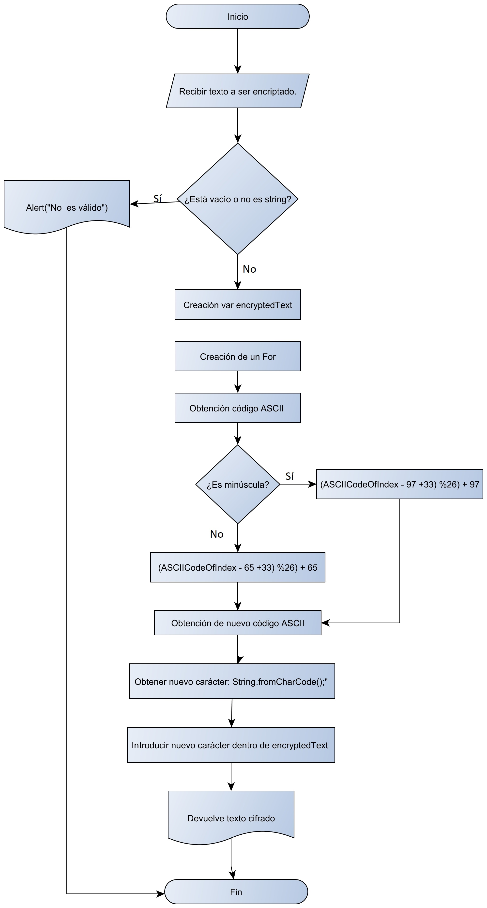
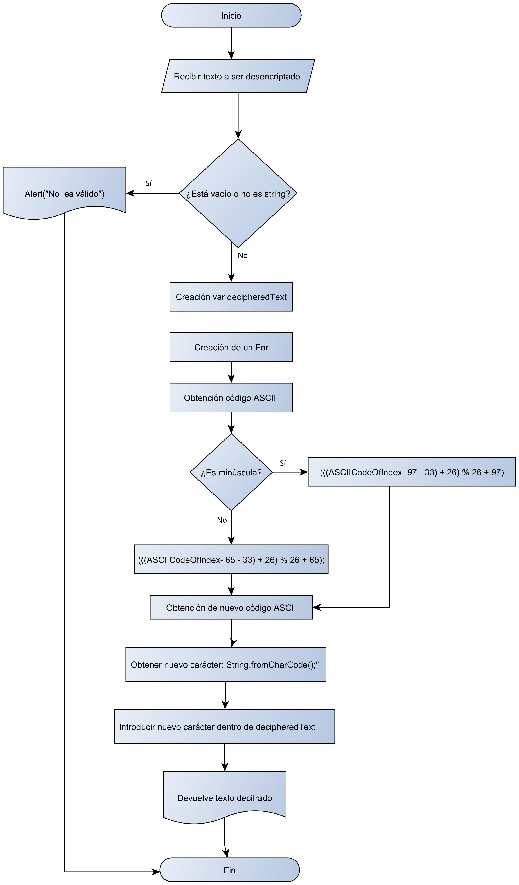

##Pseudocódigo de "Cipher" 

1. Creación de una variable que contenga un prompt, en el que se pida al usuario una frase que posteriormente será cifrada.  
2. Con un "If" debemos de comprobar si lo que el usuario introdujo mediante el promptno sea un string vacío y cuyo "typeof" no sea diferente a  "string".  Si lo es, deberá de devolver un mensaje de "Input no válido" y si cumple con las condiciones, se ejecutarán los siguientes pasos: 
4. Creación de  la variable donde irá el resultado. Es decir, el texto ya cifrado. 
5. Utilización de un "for" que vaya recorriendo cada uno de los carácteres del texto a ser cifrado. 
6. Obtención, mediante "charCodeAt", del código del carácter ASCII del carácter que va interándose por medio del "for".  
7. Utilización de la fórmula dada ((x - 65 + n) %26) + 65. Donde "n" es el número de veces que se recorre la letras, en este caso 33.  Para utilizar la fórmula dada es importante notar que la fórmula solo es aplicable al alfabeto (26 letras), y el código debe de ser capaz de distinguir entre mayúsculas y minísculas. Por lo cual, para fines prácticos tenemos dos alfabetos (mayúsculas y minísculas). Dentro del ASCII code tenemos que el alfabeto de las minúsculas  "a" empieza en el 97 y el "z" termina en 122.  En el de las mayúsculas "A" es el 65 y "Z" es el 90.  Por lo cual, la aplicación de la fórmula para minúsculas sería ((x - 97 + n )% 26) + 97. D
8. Con un if, distinguimos si la letra que se va iterando es minúscula (Rango de código ASCII mayor a 97, menor a 122) o si es mayúscula (Rango de código ASCII mayor a 65 menor a 90).
8.1 Si es minúscula, la fórmula que se aplicaría para obtener el nuevo código ASCII es: ((ASCIICodeOfIndex - 97 +33) %26) + 97. 
8.2 Si es mayúscula, la fórmula que se aplicará para obtener el nuevo código ASCII es:  ((ASCIICodeOfIndex - 65 +33) %26) + 65.
9. Una vez que tengamos nuestro nuevo código ASCII (ya cifrado) debemos de obtener el carácter al que corresponde por medo de un "String.fromCharCode(); y colocarlo en una nueva variable.
10. Debemos de introducirlo dentro de la variable que contendrá el código cifrado que ya habíamos creado con anterioridad mediante un "+=". 
11. Finalmente, la función deberá de retonar la variable en la que se encuentra el texto cifrado. 

## Diagrama de Cipher 

##Pseudocódigo de Decipher 

1. Se debe de tomar el resultado de la función anterior, creando una nueva variable e introducir ese resultado como parámetro de la función. 
2. Con un "If" debemos de comprobar que el parámetro no sea un string vacío y cuyo "typeof" no sea diferente a  "string".  Si lo es, deberá de devolver un mensaje de "Input no válido" y si cumple con las condiciones, se ejecutarán los siguientes pasos: 
4. Creación de  la variable donde irá el resultado. Es decir, el texto ya decifrado. 
5. Utilización de un "for" que vaya recorriendo cada uno de los carácteres del texto cifrado. 
6. Obtención, mediante "charCodeAt", del código del carácter ASCII del carácter que va interándose por medio del "for".  
7. Utilización de la fórmula dada ((x - 65 + n) %26) + 65. Donde "n" es el número de veces que se recorre la letras, en este caso 33. Necesitamos despejar esta fórmula para saber cuál era la posición actual del código antes de ser cifrado, es decir necesitamos encontrar a "x". Despejando, tenemos que: (((Y - posición inicial  - n) + 26) % 26 + posición inicial) donde "y" es igual a la posición del código cifrado. 
8. Con un if, distinguimos si la letra que se va iterando es minúscula (Rango de código ASCII mayor a 97, menor a 122) o si es mayúscula (Rango de código ASCII mayor a 65 menor a 90).
8.1 Si es minúscula, la fórmula que se aplicaría para obtener el nuevo código ASCII es: (((ASCIICodeOfIndex- 97 - 33) + 26) % 26 + 97);
8.2 Si es mayúscula, la fórmula que se aplicará para obtener el nuevo código ASCII es: (((ASCIICodeOfIndex- 65 - 33) + 26) % 26 + 65);
9. Una vez que tengamos nuestro nuevo código ASCII (ya decifrado) debemos de obtener el carácter al que corresponde por medo de un "String.fromCharCode(); y colocarlo en una nueva variable.
10. Debemos de introducirlo dentro de la variable que contendrá el código decifrado que ya habíamos creado con anterioridad mediante un "+=". 
11. Finalmente, la función deberá de retonar la variable en la que se encuentra el texto decifrado. 

##Diagrama de Decipher

