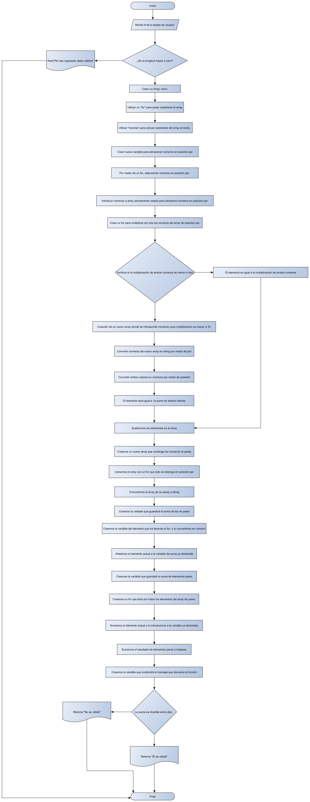

##Pseudocódigo de "Valid Credit Card" 
1. Preguntar, por medio de un prompt, al usuario por el numero de la tarjeta. 
2. Comprobar que la longitud de los datos introducidos por el usuario son iguales a cero. En este caso, enviar un alert diciendo que los datos proporcionados no son válidos. En caso de que la longitud del input no sea igual a cero, se continuará ejecutando la función.  
3. Crear una array vacío. 
4. Por medio de un "for" ir pasando cada uno de los carácteres del input hacia un array.  
5. Una vez que ya tengamos todos los carácteres del input separados en elementos al interior de un array, con la función "reverse" colocarlos en el orden contrario.
6. Crear una nueva variable donde se almacenarán los numeros que se encuentran en posición par. 
7. Por medio de un "for" vamos seleccionando los numeros en posición imar (números en posición par del array).
8. Introducimos los números en posición par dentro de un nuevo array. 
9. Creamos un "for" que vaya multiplicando todos los nuevos elementos del nuevo array. 
10. Verificamos si la multiplicación de cada número por dos es menor a diez, el nuevo elemento es igual a esa multiplicación.
11. Si no lo es, creamos un nuevo array donde introduciremos aquellos números. 
12. Convertimos a los números dentro de aquél array en string. 
13. Creamos ambos valores que deben de ser sumados, y les colocamos "parseInt" para convertirlos en numeros. 
14. Sacamos la suma de ambos. 
15. Sustituimos los números obtenidos por medio de la multiplicación, y por medio de la suma de ambos dígitos en el array de números pares. 
16. Creamos un nuevo array que contenga los números no pares del número de tarjeta. Llenamos el array con un for que iterará los números de la tarjeta y solo se detendrá en los números de posición par. 
17. Convertimos el array de no pares a string. 
18. Creamos la variable que guardará la suma de los números no pares. 
19. Creamos la variable del elemento que irá iterando el  for y convertimos el tipo de elemento en número. 
20. Añadimos el elemento que está iterándose a la variable de suma ya declarada.
21. Creamos la variable que guardará la suma de los elementos pares. 
22. Creamos un for que vaya iterando por todos los elementos del array de números pares. 
23. Sumamos cada uno de los elementos que vaya iterando el for y los introducimos en la suma de elementos pares. 
24. Sumamos el resultado de la suma de elementos pares e impares.
25. Creamos la variable que contendrá el mensaje que devolverá la función. 
26. Hacemos un if que compruebe si la suma es divisible entre 10.  Si lo es, el mensaje que se devolverá es "Es válida", si no lo es, el mensaje que se devolverá es "No es válida". 

 ##Diagrama de Flujo de "Valid Credit Card"     
 
 
 